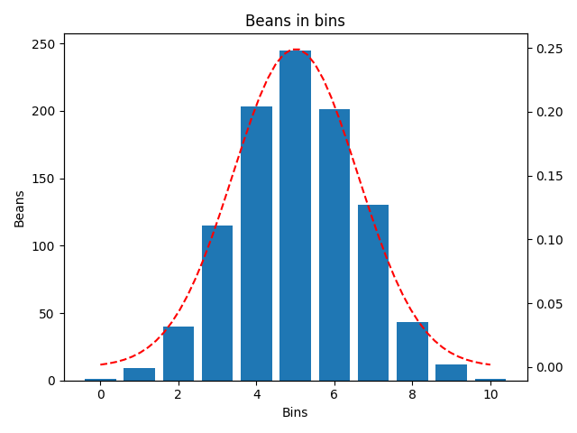

# Quincunx

Simulate the *Galton board* using threading.

The *bean machine*, also known as the *Galton Board* or *quincunx*, is a device invented by Sir Francis Galton to demonstrate the central limit theorem, in particular that the normal distribution is approximate to the binomial distribution.

## Requirements

1. The board should have the specified size (11 by default).
2. There are should be some number of beans (default: 1000), each represented by a thread.
3. Initial state of the board: all particles in the staring position (default: middle of the board of 11 bins).
4. At every step a particle can move left or right with some probability (default: 50%).
5. Each bin bounces off the finite number of pegs.
6. The program must take parameters as command-line arguments and parse them.
   1. `show` and `debug` arguments are optional
   2. all arguments must have their defaults set so the following command works: `python3 galton.py`

```bash
python3 galton.py --beans 1000 --bins 11 --start 5 --prob 0.5 --show --debug
Beans: 1000, bins: 11, start: 5, prob: 0.5
Start
|   0  |   0  |   0  |   0  |   0  | 1000 |   0  |   0  |   0  |   0  |   0  |      1000
|   2  |  12  |  37  |  120 |  180 |  239 |  209 |  144 |  39  |  15  |   3  |      1000
Done
```



## References

- [Bean machine - Wikipedia](https://en.wikipedia.org/wiki/Bean_machine)
- [Thread (Java SE 20 & JDK 20)](https://docs.oracle.com/en/java/javase/20/docs/api/java.base/java/lang/Thread.html)
- [Lesson: Concurrency (The Java™ Tutorials > Essential Classes)](https://docs.oracle.com/javase/tutorial/essential/concurrency/)
- [threading — Thread-based parallelism — Python 3.11.3 documentation](https://docs.python.org/3/library/threading.html)
- [threading — Manage Concurrent Operations Within a Process — PyMOTW 3](https://pymotw.com/3/threading/)
